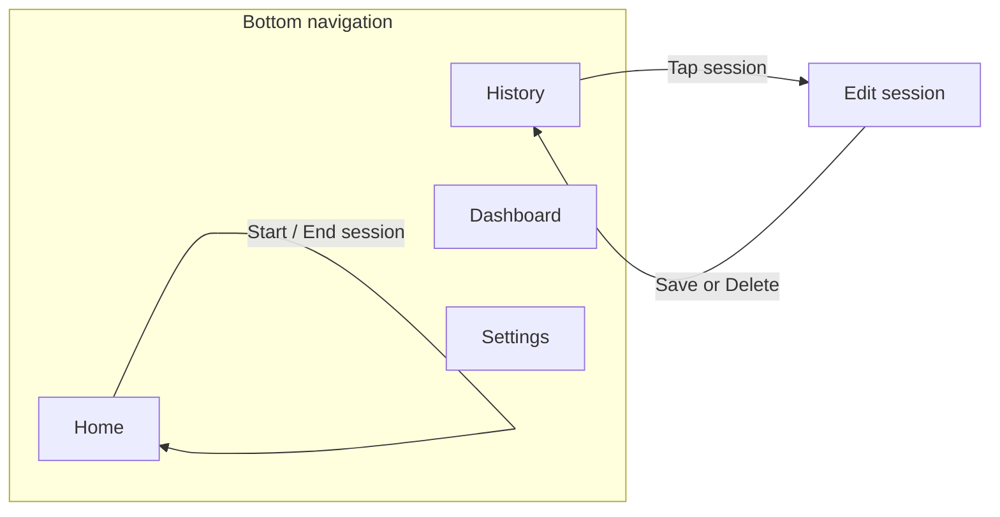

# CS501 Clock In

## Project Overview

**ClockIn** is a mobile-first time tracking app for students and young professionals. It helps users record **what they actually did** during the day, not just what they planned to do. The main value is improving **time awareness** and helping users compare **intention vs. reality**.

- **Mobile-first** — designed for phone use as the primary experience.
- **Persistent local data** — supports storing entries and settings on device (e.g., Room, DataStore).
- **Location / GPS** — can tie time entries to places when we add that feature.
- **Notifications & background behavior** — can remind users to log or follow up on entries.
- **Modern Android stack** — can be built with **Jetpack Compose**, **ViewModel**, **Navigation**, and **Room** / **DataStore** as appropriate.

This repository contains our CS501 Clock In Android implementation of ClockIn.

## User flow

The app uses a **bottom navigation bar** with four destinations: **Home**, **History**, **Dashboard**, and **Settings**. **Edit session** opens as a separate screen when the user picks a past session from History.

### Primary loop (recording what you did)

1. Open the app — lands on **Home** (Quick Start).
2. **Choose an activity tag** (e.g., study, work) that best describes what you are *actually* doing.
3. Tap **Start** to begin a timed session for that tag.
4. When you switch tasks or finish, tap **End** to close the session. The entry is **saved locally** with start/end times and metadata.
5. Repeat through the day to build an honest log of real activity (not just plans).

On **Home**, users can also **grant location** (optional) and see **context** such as refreshed location and weather when enabled—supporting awareness of *where* time was spent as the product evolves.

### Reviewing and comparing intention vs. reality

6. **History** — scroll the list of saved sessions. **Tap a session** to open **Edit session**, where you can update details, **save** changes, or **delete** the entry, then return to History.
7. **Dashboard** — see **today’s totals by activity tag** (excluding idle) to compare how time was actually spent.
8. **Settings** — reserved for preferences (e.g., DataStore-backed options); currently an MVP placeholder in code.

### Navigation map

## AI Disclosure

### How we used AI

- **Understanding APIs and errors**: clarifying Android/Gradle/Kotlin error messages and suggesting likely causes.
- **Small code patterns**: generating *candidate* snippets for common Android patterns (e.g., UI wiring, data classes, null-safety, formatting).
- **Refactoring suggestions**: proposing cleaner structure, naming, or decomposition after we already understood the behavior we needed.
- **Test/edge-case brainstorming**: listing cases to verify manually in the emulator/device.

### What we did not use AI for

- **No blind copy/paste** of large, unreviewed solutions.
- **No fabrication acceptance**: we did not accept claims without verifying in code, Android Studio, or official documentation.
- **No bypassing learning goals**: we did not use AI to avoid understanding course concepts; we used it to accelerate iteration after we understood requirements.

### Acceptance / rejection criteria (how we stayed responsible)

We treated AI output as a draft. We **accepted** suggestions only when they:

- compiled and ran in our project setup,
- matched assignment requirements and our app’s UX expectations,
- were understandable to the team (we could explain the code),
- and did not introduce security/privacy regressions.

We **rejected or revised** suggestions when they:

- relied on deprecated APIs or mismatched library versions,
- introduced unnecessary complexity or architecture changes,
- produced incorrect behavior on-device,
- or conflicted with course constraints or our existing code style.

## Team Progress & Collaboration

We coordinated work to keep contributions **balanced** and to avoid integration surprises. Our collaboration emphasized frequent communication, small reviewable changes, and clear ownership of features.

### Collaboration process

- **Planning**: agreed on requirements, broke work into small tasks, and wrote down acceptance criteria (what “done” means).
- **Coordination**: regular check-ins to unblock each other and prevent duplicate work.
- **Integration**: merged changes frequently and resolved conflicts early rather than in one large end-of-sprint merge.
- **Quality control**: team members reviewed each other’s changes (informally or via PRs), and we tested flows on emulator/device after merges.
