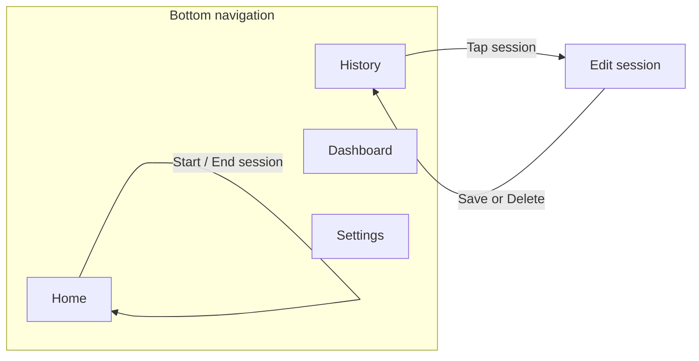

# CS501 Clock In

## Project Overview

**ClockIn** is a mobile-first time tracking app for students and young professionals. It helps users record **what they actually did** during the day, not just what they planned to do. The main value is improving **time awareness** and helping users compare **intention vs. reality**.

- **Mobile-first** — designed for phone use as the primary experience.
- **Persistent local data** — supports storing entries and settings on device (e.g., Room, DataStore).
- **Location / GPS** — optional fused location for **saved places** and **tag suggestions**; per-session geotagging is not stored in Room today.
- **Notifications & background behavior** — can remind users to log or follow up on entries.
- **Modern Android stack** — can be built with **Jetpack Compose**, **ViewModel**, **Navigation**, and **Room** / **DataStore** as appropriate.

This repository contains our CS501 Clock In Android implementation of ClockIn.

## Presentation documentation

### Product vision

**ClockIn** helps you track **what you actually did**, not just what you planned—fast session tracking, history, editing, and lightweight reflection so you can see where time really went.

### Problems we address

- **Lost time** — Students and professionals plan their day but rarely know where time actually went.
- **Friction kills habits** — Tracking must be fast and interruption-friendly to stick.
- **Mobile-first** — Quick start/stop throughout the day demands a phone-first experience.

### Core experience — what ClockIn does

1. **Pick a tag** — Default tags (e.g., Study, Class, Gym, Work, Errands) plus custom tags; start from **Home** or from **notification actions** when tracking is enabled.
2. **Review and edit** — Open **History**, tap a session, then **Edit session** to change tag, notes, or times; save or delete.
3. **Get suggestions** — Optional **location-based** notifications suggest switching to a tag when you are near a **saved location** (Settings).
4. **Dashboard** — See **time per tag** for a selected day (defaults to today; use arrows to move between days), excluding idle where applicable.

### New / extended features

- **Location-based suggestions** — Proximity to saved locations drives optional suggestion notifications (see `SuggestionsViewModel`, `LocationSuggestionNotifier`).
- **Persistent notification** — Foreground **session tracking** service with actions to switch tags; which tags appear is configured in **Settings → Notifications** (up to three quick tags).
- **Custom tags** — Create tags in Settings; choose which tags appear on **Home** (home visible tags).

### Navigation

Bottom navigation: **Home**, **History**, **Dashboard**, **Settings**. **Edit session** is a separate route (`edit/{sessionId}`) opened from History. See the **Navigation map** section below.

### MVVM flow

Compose **UI** collects `StateFlow` / `Flow` state from **ViewModels**. ViewModels call **repositories** and **`ActiveSessionStore`** (in-memory active session); repositories map **Room entities** and **DataStore** preferences to domain models. A **foreground service** also observes the same store and preferences to keep the ongoing notification in sync. Team members using Cursor may keep exportable architecture canvases locally (e.g. `clockin-diagram-mvvm-flow.canvas.tsx`); they are not required to build the app.

### Data schemas

- **Room** (`clockin.db`): tables **`sessions`** and **`saved_locations`** — see `app/src/main/java/com/example/cs501clockin/data/db/`.
- **DataStore** (`user_prefs`): notification toggles, location suggestions toggle, custom tags, home visible tags, notification quick tags — see `UserPreferencesRepository.kt`.

### Debugging and testing strategy

- **Compose previews** — Screen-level `@Preview` composables live in `app/src/main/java/com/example/cs501clockin/ui/preview/ClockInScreenPreviews.kt`. Open them in **Split / Design** in Android Studio to iterate on Home, History, Dashboard, Edit session, and Settings without a full run.
- **Room / data (manual)** — Use **Database Inspector** (sessions / saved_locations) and **Logcat** (e.g. `ActiveSessionStore`, `EditSessionViewModel`) while exercising flows on an emulator or device.
- **Manual QA** — Same edge cases as before: permission denial, rapid start/end, delete session, day changes on Dashboard, notification actions.
- **Automated in-memory Room tests** — `SessionDaoInstrumentedTest` and `SavedLocationDaoInstrumentedTest` under `app/src/androidTest/.../data/db/` use `Room.inMemoryDatabaseBuilder` and `runBlocking { dao.observe…().first() }` to verify ordering, upsert, update, and delete behavior.
- **JVM unit tests** — `SessionDurationTest` and `TimeParsingTest` under `app/src/test/` cover small pure helpers on the host (no device).

**Run tests**

- Host (fast): `./gradlew :app:testDebugUnitTest`
- Device / emulator: `./gradlew :app:connectedDebugAndroidTest` (runs instrumented tests including Room DAO tests)

### Future features

- **Google Calendar sync** — Auto-suggest sessions from scheduled events.
- **Lock screen widget** — Quick tag change from the lock screen.
- **Automatic locations** — Infer frequent places without manual pin drops (privacy-sensitive; future research).

### Team workflow

- **Sadid** — Data layer, Room, notifications, location logic.
- **Saksham** — UI/UX, Compose screens, navigation, dashboard.
- **Shared** — Architecture, testing, debugging, integration, presentation.

### AI usage

Aligned with **AI Disclosure** below: AI assisted with brainstorming, explanations, boilerplate, and debugging; all outputs were reviewed, tested, and corrected before acceptance.

---

## Feature list and status

| Feature                                                 | Status              | Notes                                                                   |
| ------------------------------------------------------- | ------------------- | ----------------------------------------------------------------------- |
| Bottom navigation (Home, History, Dashboard, Settings)  | **Done**            | `MainActivity.kt`, `Routes.kt`                                          |
| Tag-based sessions (start / end / switch)               | **Done**            | `HomeViewModel`, `ActiveSessionStore`                                   |
| Idle vs. non-idle session model                         | **Done**            | `SessionTags`, store persists completed sessions                        |
| Session history list                                    | **Done**            | `HistoryScreen`, `HistoryViewModel`, Room Flow                          |
| Edit session (tag, notes, times)                        | **Done**            | `EditSessionScreen`, `EditSessionViewModel`                             |
| Delete session                                          | **Done**            | From edit screen → `SessionRepository.deleteById`                       |
| Dashboard: time per tag for a day                       | **Done**            | `DashboardScreen` with day offset (not a single “week” aggregate bar)   |
| DataStore preferences (notifications, tags, visibility) | **Done**            | `UserPreferencesRepository.kt`                                          |
| Custom tags                                             | **Done**            | Settings CRUD on preferences                                            |
| Home visible tags                                       | **Done**            | Filters chips on Home                                                   |
| Foreground session tracking + notification actions      | **Done**            | `SessionTrackingService`, started from `ClockInApp` when prefs allow    |
| Notification quick tags (up to 3)                       | **Done**            | Settings; enforced in repository                                        |
| Saved locations (label, lat/lon, radius, suggested tag) | **Done**            | Room `saved_locations`; CRUD in Settings                                |
| Map picker for saved locations                          | **Done**            | Requires `MAPS_API_KEY` in `local.properties`                           |
| Location-based tag suggestions                          | **Done**            | `SuggestionsViewModel` + `LocationSuggestionNotifier`                   |
| Fused location for current position                     | **Done**            | `LocationRepository` (Play Services)                                    |
| Location permission flow                                | **Done**            | Home / Settings as applicable                                           |
| Post-notifications permission (Android 13+)             | **Done**            | `MainActivity`                                                          |
| Architecture diagrams (MVVM, deps, nav, schemas)        | **Done**            | Optional Cursor canvases (local IDE export); not part of Gradle sources |
| Weather on Home                                         | **Not implemented** | Mentioned as future context in README only                              |
| Google Calendar sync                                    | **Planned**         | Slide roadmap                                                           |
| Lock screen widget                                      | **Planned**         | Slide roadmap                                                           |
| Automatic inferred locations                            | **Planned**         | Slide roadmap                                                           |
| In-memory Room tests for DAOs                           | **Done**            | `app/src/androidTest/.../data/db/*InstrumentedTest.kt` (instrumented)   |
| JVM unit tests (model / time parsing)                   | **Done**            | `app/src/test/.../SessionDurationTest.kt`, `TimeParsingTest.kt`         |
| Compose `@Preview` for main screens                     | **Done**            | `ui/preview/ClockInScreenPreviews.kt`                                   |

---

## User flow

The app uses a **bottom navigation bar** with four destinations: **Home**, **History**, **Dashboard**, and **Settings**. **Edit session** opens as a separate screen when the user picks a past session from History.

## Setup (Google Maps API key)

The Settings screen includes a **“Pick location on map”** feature using **Google Maps**. To run it, you must provide a Maps SDK for Android API key **locally** (it is **not** committed to this repo).

- **Step 1**: Create (or edit) the file `local.properties` at the project root (same level as `settings.gradle.kts`).
- **Step 2**: Add your key:

```properties
MAPS_API_KEY=YOUR_REAL_KEY_HERE
```

### Primary loop (recording what you did)

1. Open the app — lands on **Home** (Quick Start).
2. **Choose an activity tag** (e.g., study, work) that best describes what you are _actually_ doing.
3. Tap **Start** to begin a timed session for that tag.
4. When you switch tasks or finish, tap **End** to close the session. The entry is **saved locally** with start/end times and metadata.
5. Repeat through the day to build an honest log of real activity (not just plans).

On **Home**, users can **grant location** (optional) and refresh **current coordinates** for location-based suggestions; **weather** is not implemented in this repo yet.

### Reviewing and comparing intention vs. reality

6. **History** — scroll the list of saved sessions. **Tap a session** to open **Edit session**, where you can update details, **save** changes, or **delete** the entry, then return to History.
7. **Dashboard** — see **today’s totals by activity tag** (excluding idle) to compare how time was actually spent.
8. **Settings** — notifications, location suggestions, custom tags, home/notification tag picks, and saved locations (including map picker when a Maps API key is configured).

### Navigation map



## AI Disclosure

### How we used AI

- **Understanding APIs and errors**: clarifying Android/Gradle/Kotlin error messages and suggesting likely causes.
- **Small code patterns**: generating _candidate_ snippets for common Android patterns (e.g., UI wiring, data classes, null-safety, formatting).
- **Refactoring suggestions**: proposing cleaner structure, naming, or decomposition after we already understood the behavior we needed.
- **Test/edge-case brainstorming**: listing cases to verify manually in the emulator/device.

### What we did not use AI for

- **No blind copy/paste** of large, unreviewed solutions.
- **No fabrication acceptance**: we did not accept claims without verifying in code, Android Studio, or official documentation.
- **No bypassing learning goals**: we did not use AI to avoid understanding course concepts; we used it to accelerate iteration after we understood requirements.

### Acceptance / rejection criteria (how we stayed responsible)

We treated AI output as a draft. We **accepted** suggestions only when they:

- compiled and ran in our project setup,
- matched assignment requirements and our app’s UX expectations,
- were understandable to the team (we could explain the code),
- and did not introduce security/privacy regressions.

We **rejected or revised** suggestions when they:

- relied on deprecated APIs or mismatched library versions,
- introduced unnecessary complexity or architecture changes,
- produced incorrect behavior on-device,
- or conflicted with course constraints or our existing code style.

## Team Progress & Collaboration

We coordinated work to keep contributions **balanced** and to avoid integration surprises. Our collaboration emphasized frequent communication, small reviewable changes, and clear ownership of features.

### Collaboration process

- **Planning**: agreed on requirements, broke work into small tasks, and wrote down acceptance criteria (what “done” means).
- **Coordination**: regular check-ins to unblock each other and prevent duplicate work.
- **Integration**: merged changes frequently and resolved conflicts early rather than in one large end-of-sprint merge.
- **Quality control**: team members reviewed each other’s changes (informally or via PRs), and we tested flows on emulator/device after merges.
