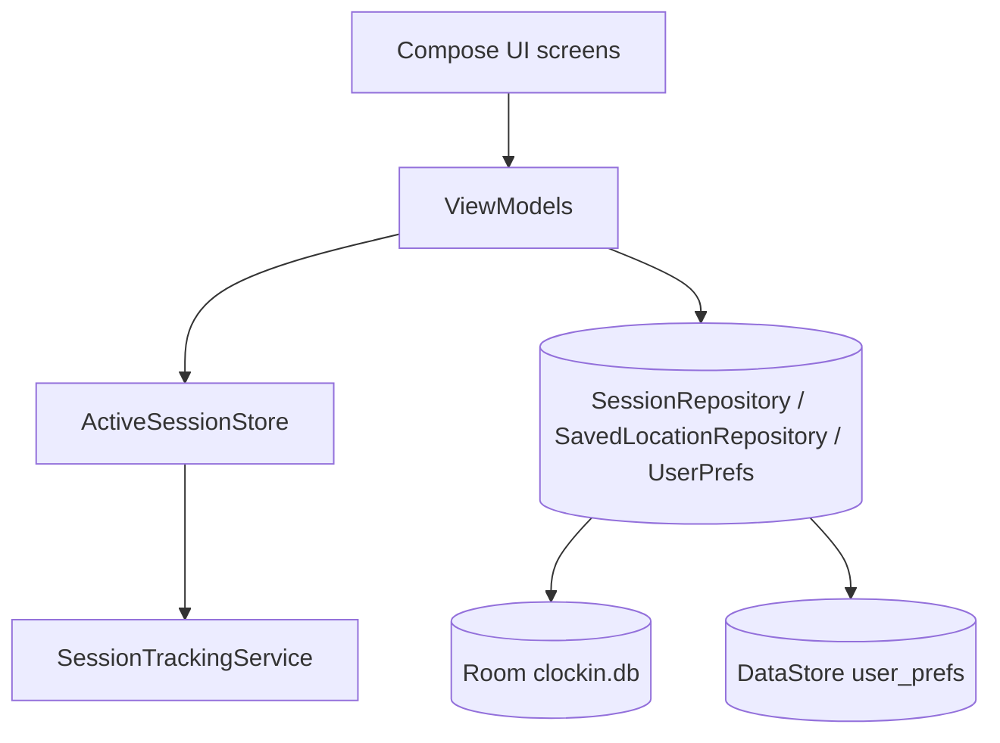
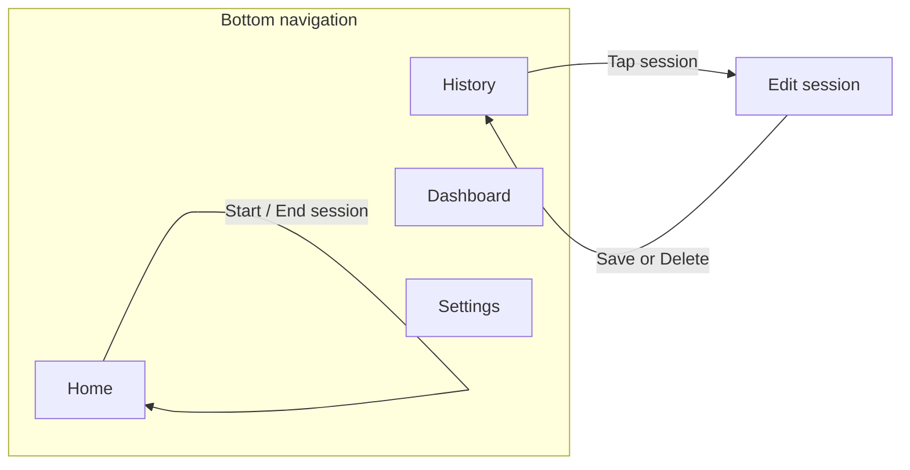

# CS501 Clock In

## Project Overview

**ClockIn** is a mobile-first time tracking app for students and young professionals. It helps users record **what they actually did** during the day, not just what they planned to do. The main value is improving **time awareness** and helping users compare **intention vs. reality**.

- **Mobile-first** — designed for phone use as the primary experience.
- **Persistent local data** — supports storing entries and settings on device (e.g., Room, DataStore).
- **Location / GPS** — optional fused location for **saved places** and **tag suggestions**; per-session geotagging is not stored in Room today.
- **Notifications & background behavior** — can remind users to log or follow up on entries.
- **Modern Android stack** — can be built with **Jetpack Compose**, **ViewModel**, **Navigation**, and **Room** / **DataStore** as appropriate.

This repository contains our CS501 Clock In Android implementation of ClockIn.

### Product vision

**ClockIn** helps you track **what you actually did**, not just what you planned—fast session tracking, history, editing, and lightweight reflection so you can see where time really went.

### Problems we address

- **Lost time** — Students and professionals plan their day but rarely know where time actually went.
- **Friction kills habits** — Tracking must be fast and interruption-friendly to stick.
- **Mobile-first** — Quick start/stop throughout the day demands a phone-first experience.

### Core experience — what ClockIn does

1. **Pick a tag** — Default tags (e.g., Study, Class, Gym, Work, Errands) plus custom tags; start from **Home** or from **notification actions** when tracking is enabled.
2. **Review and edit** — Open **History**, tap a session, then **Edit session** to change tag, notes, or times; save or delete.
3. **Get suggestions** — Optional **location-based** notifications suggest switching to a tag when you are near a **saved location** (Settings).
4. **Dashboard** — See **time per tag** for a selected day (defaults to today; use arrows to move between days), excluding idle where applicable.

### Navigation

Bottom navigation: **Home**, **History**, **Dashboard**, **Settings**. **Edit session** is a separate route (`edit/{sessionId}`) opened from History. See the **Navigation map** section below.

### Architecture

We follow **MVVM**: Compose **UI** observes `**StateFlow` / `Flow`** from **ViewModels**; ViewModels call **repositories** and `**ActiveSessionStore`**; repositories encapsulate **Room** and **DataStore. Platform components (foreground service, location, widget) sit alongside the UI layer and read the same prefs / session sources where needed.


| Layer                        | Role                                                              | Main locations                                                      |
| ---------------------------- | ----------------------------------------------------------------- | ------------------------------------------------------------------- |
| **UI**                       | Screens, dialogs, onboarding, Compose previews                    | `MainActivity.kt`, `ui/screens/`*, `ui/onboarding/*`, `ui/preview/` |
| **Presentation logic**       | State, validation, bridging user actions                          | `viewmodel/`                                                        |
| **Domain & in-memory state** | `Session`, tag names, durations; **live session** until End       | `model/`, `data/state/ActiveSessionStore.kt`                        |
| **Data**                     | SQLite via Room; user prefs via DataStore                         | `data/db/`*, `data/repo/*`                                          |
| **Platform & integrations**  | Ongoing tracking notification, fused location, map picker, widget | `notification/`, `location/`, `widget/`, `MapPickerDialog`          |


**Important behavior:** `**ActiveSessionStore`** holds the *current* session in memory while tracking. When the user ends a session, the store persists a completed row via `**SessionRepository`** into Room. **Session rows do not store latitude/longitude**; GPS is used only to compare **current position ↔ saved_locations** for optional tag suggestions.




---

### Database usage and schema

#### Room (`clockin.db`)

- **Initialization:** `Room.databaseBuilder` in `ClockInApp.kt`; database file name `**clockin.db`.
- **Version:** `**2`** (`AppDatabase.kt`); `**exportSchema = true\*\*` (JSON exports can live under version control when generated).
- **Migrations:** the app uses `**fallbackToDestructiveMigration()`** — a schema bump **drops and recreates** the DB (acceptable for coursework / iterative development, **not a production migration strategy).

**Table `sessions`** (`SessionEntity`)


| Column            | Type      | Notes                                                               |
| ----------------- | --------- | ------------------------------------------------------------------- |
| `id`              | `Long`    | **Primary key** (timestamp-based ID from the active session flow)   |
| `tag`             | `String`  | Activity label (built-in or custom tag name)                        |
| `startTimeMillis` | `Long`    | Epoch ms                                                            |
| `endTimeMillis`   | `Long?`   | `null` while active only in memory; set when persisted as completed |
| `notes`           | `String?` | Optional                                                            |
| `edited`          | `Boolean` | User edited after initial save                                      |


**Table `saved_locations`** (`SavedLocationEntity`)


| Column         | Type     | Notes                                         |
| -------------- | -------- | --------------------------------------------- |
| `id`           | `Long`   | **Primary key**, `autoGenerate = true`        |
| `label`        | `String` | User-visible place name                       |
| `latitude`     | `Double` | WGS84                                         |
| `longitude`    | `Double` | WGS84                                         |
| `suggestedTag` | `String` | Tag name suggested when nearby                |
| `radiusMeters` | `Int`    | Geofence-style radius (default 150 in entity) |


**Relationships:** No SQL foreign keys. `**sessions.tag`** and `**saved_locations.suggestedTag\*\*` logically reference tag strings from defaults + DataStore custom tags.

**Indexes:** Only primary keys; no extra Room indices in this project.

**DAO usage:** Typical **Flow** / **suspend** reads and writes (`SessionDao`, `SavedLocationDao`); repositories (`SessionRepository`, `SavedLocationRepository`) are the callers.

#### Jetpack DataStore Preferences (`user_prefs`)

File-backed preferences via `preferencesDataStore` in `**UserPreferencesRepository.kt`.


| Preference key(s)                                           | Type                 | Purpose                                         |
| ----------------------------------------------------------- | -------------------- | ----------------------------------------------- |
| `notifications_enabled`                                     | Boolean              | Session tracking notification on/off            |
| `location_suggestions_enabled`                              | Boolean              | Near-place tag suggestions                      |
| `custom_tags`                                               | String set           | Custom tag names (excluding built-in defaults)  |
| `home_visible_tags`                                         | String set           | Which tags appear on Home / widget order source |
| `notification_quick_tags`                                   | String set           | Up to **3** tags for notification actions       |
| `custom_tag_colors`                                         | String (JSON object) | Per–custom-tag ARGB (`tagName` → `int`)         |
| `onboarding_welcome_completed`                              | Boolean              | First-run welcome                               |
| `onboarding_tip_home_seen` … `onboarding_tip_settings_seen` | Boolean              | One-time tab tips                               |


**Derived state:** `UserPreferences.allTags` merges `**SessionTags.defaults`** with `**custom_tags\*\*` for pickers and validation.

---

### APIs, sensors, and platform usage

#### Permissions (`AndroidManifest.xml`)


| Permission                                                      | Why                                                                   |
| --------------------------------------------------------------- | --------------------------------------------------------------------- |
| `**ACCESS_FINE_LOCATION`**                                      | Single high-accuracy fixes and suggestions vs. `**saved_locations**`  |
| `**INTERNET**`                                                  | **Google Maps** tiles/API for map picker                              |
| `**FORECROUND_SERVICE`** + `**FORECROUND_SERVICE_DATA_SYNC\*\*` | `**SessionTrackingService`** while a session may be ongoing           |
| `**POST_NOTIFICATIONS**`                                        | Android **13+** runtime prompt for ongoing / suggestion notifications |


Runtime requests: **fine location** (Home / flows that need fixes), **post-notifications** (requested from `**MainActivity` on launch where applicable).

#### Location (sensor & Google Play services)

- `**LocationRepository`** uses `**LocationServices.getFusedLocationProviderClient**`, `**getCurrentLocation**`, `**LocationRequest**` / `**Priority**`, `**LocationCallback**` as needed (`location/LocationRepository.kt`).
- **Not** stored per session; used to compute distance to saved places in `**SuggestionsViewModel`.

#### Google Maps SDK

- **Maps SDK for Android** for **Settings → Pick location on map** (`MapPickerDialog`, manifest `com.google.android.geo.API_KEY` → string from `**local.properties` `MAPS_API_KEY` at build time).
- Requires **network** for map imagery.

#### Notifications & background work

- `**SessionTrackingService`**: foreground service, `**exported="false"`**, type `**dataSync**`; builds an ongoing `**Notification**`with quick actions wired to`**ActiveSessionStore.switchTo(tag)\*\*`.
- `**LocationSuggestionNotifier**`: notifies when a saved-place suggestion fires (behavior described in README user flows).
- `**SuggestionActionReceiver**`: `**exported="false"**`, handles taps from suggestion UX.

#### App widget

- `**TagSwitchWidgetProvider**` + `**TagWidgetRemoteViewsService**` (`**BIND_REMOTEVIEWS**`) supply a scrollable `**RemoteViews**` list of tags; `**WidgetTagClickReceiver**` applies tag switches consistent with Home.

#### Other APIs

- **Jetpack Navigation Compose** (`NavHost`, argument for edit route).
- **Kotlin coroutines / Flow** across UI, datastore, Room, service.
- **Material 3** Compose components for UI.

---

### Debugging and testing strategy

- **Compose previews** — Screen-level `@Preview` composables live in `app/src/main/java/com/example/cs501clockin/ui/preview/ClockInScreenPreviews.kt`. Open them in **Split / Design** in Android Studio to iterate on Home, History, Dashboard, Edit session, and Settings without a full run.
- **Room / data (manual)** — Use **Database Inspector** (sessions / saved_locations) and **Logcat** (e.g. `ActiveSessionStore`, `EditSessionViewModel`) while exercising flows on an emulator or device.
- **Manual QA** — Same edge cases as before: permission denial, rapid start/end, delete session, day changes on Dashboard, notification actions.
- **Automated in-memory Room tests** — `SessionDaoInstrumentedTest` and `SavedLocationDaoInstrumentedTest` under `app/src/androidTest/.../data/db/` use `Room.inMemoryDatabaseBuilder` and `runBlocking { dao.observe…().first() }` to verify ordering, upsert, update, and delete behavior.
- **JVM unit tests** — `SessionDurationTest` and `TimeParsingTest` under `app/src/test/` cover small pure helpers on the host (no device).

**Run tests**

- Host (fast): `./gradlew :app:testDebugUnitTest`
- Device / emulator: `./gradlew :app:connectedDebugAndroidTest` (runs instrumented tests including Room DAO tests)

### Team responsibilities and contributions

We divided ownership **by subsystem** while keeping integration **shared** so no single person was bottlenecked at merge time. The table below summarizes **primary** ownership; many items were **reviewed or touched by multiple people** during integration and QA.


| Team member      | Primary ownership                                                                                                                                                                                                                                                                                                                           |
| ---------------- | ------------------------------------------------------------------------------------------------------------------------------------------------------------------------------------------------------------------------------------------------------------------------------------------------------------------------------------------- |
| **Sadid**        | Room schema/DAOs/repositories (`**sessions`**, `**saved_locations`**), `**SessionTrackingService**`and ongoing notification plumbing,`**LocationRepository**`and suggestion pipeline,`**LocationSuggestionNotifier**`/ receivers,`**ActiveSessionStore` ↔ foreground service coordination                                                   |
| **Saksham**      | Compose **UI/UX**: Home, History, Dashboard, Edit session, Settings layouts; **navigation** scaffolding; `**Dashboard`** and history presentation; `**MapPickerDialog\*\*` UX integration; onboarding/dialog polish where applicable                                                                                                        |
| **Shared / all** | **Architecture** conventions (MVVM boundaries), `**MainActivity`** / `**ClockInApp`**wiring,`**UserPreferencesRepository**` / DataStore semantics, **home screen widget**, **Gradle**/build hygiene, **instrumented DAO tests**, **JVM unit tests**, **Compose previews**, **README**, **presentation, regression passes on emulator/device |


**How we collaborated:** small tasks with clear acceptance criteria; frequent sync on **.prefs vs. notification vs. widget** consistency; PR or informal review before treating a feature done; emulator/device verification after merges (permissions, notification actions, suggestion flow).

---

## Feature list and status


| Feature                                                 | Status           | Notes                                                                                |
| ------------------------------------------------------- | ---------------- | ------------------------------------------------------------------------------------ |
| Bottom navigation (Home, History, Dashboard, Settings)  | **Done**         | `MainActivity.kt`, `Routes.kt`                                                       |
| Tag-based sessions (start / end / switch)               | **Done**         | `HomeViewModel`, `ActiveSessionStore`                                                |
| Idle vs. non-idle session model                         | **Done**         | `SessionTags`, store persists completed sessions                                     |
| Session history list                                    | **Done**         | `HistoryScreen`, `HistoryViewModel`, Room Flow                                       |
| Edit session (tag, notes, times)                        | **Done**         | `EditSessionScreen`, `EditSessionViewModel`                                          |
| Delete session                                          | **Done**         | From edit screen → `SessionRepository.deleteById`                                    |
| Dashboard: time per tag for a day                       | **Done**         | `DashboardScreen` with day offset (not a single “week” aggregate bar)                |
| DataStore preferences (notifications, tags, visibility) | **Done**         | `UserPreferencesRepository.kt`                                                       |
| Custom tags                                             | **Done**         | Settings CRUD on preferences                                                         |
| Home visible tags                                       | **Done**         | Filters chips on Home                                                                |
| Foreground session tracking + notification actions      | **Done**         | `SessionTrackingService`, started from `ClockInApp` when prefs allow                 |
| Notification quick tags (up to 3)                       | **Done**         | Settings; enforced in repository                                                     |
| Saved locations (label, lat/lon, radius, suggested tag) | **Done**         | Room `saved_locations`; CRUD in Settings                                             |
| Map picker for saved locations                          | **Done**         | Requires `MAPS_API_KEY` in `local.properties`                                        |
| Location-based tag suggestions                          | **Done**         | `SuggestionsViewModel` + `LocationSuggestionNotifier`                                |
| Fused location for current position                     | **Done**         | `LocationRepository` (Play Services)                                                 |
| Location permission flow                                | **Done**         | Home / Settings as applicable                                                        |
| Post-notifications permission (Android 13+)             | **Done**         | `MainActivity`                                                                       |
| Google Calendar sync                                    | **Planned**      | Slide roadmap                                                                        |
| Home screen tag widget                                  | **Done**         | `widget/TagSwitchWidgetProvider`; tags mirror Home                                   |
| Onboarding flow                                         | **Done**         | `WelcomeOnboardingDialog` + `TabOnboardingDialog` in `MainActivity`; DataStore flags |
| Automatic inferred locations                            | **Out of scope** | No auto-discovery of places; saved locations are user-defined only                   |
| In-memory Room tests for DAOs                           | **Done**         | `app/src/androidTest/.../data/db/*InstrumentedTest.kt` (instrumented)                |
| JVM unit tests (model / time parsing)                   | **Done**         | `app/src/test/.../SessionDurationTest.kt`, `TimeParsingTest.kt`                      |
| Compose `@Preview` for main screens                     | **Done**         | `ui/preview/ClockInScreenPreviews.kt`                                                |


---

## User flow

The app uses a **bottom navigation bar** with four destinations: **Home**, **History**, **Dashboard**, and **Settings**. **Edit session** opens as a separate screen when the user picks a past session from History.

## Setup (Google Maps API key)

The Settings screen includes a **“Pick location on map”** feature using **Google Maps**. To run it, you must provide a Maps SDK for Android API key **locally** (it is **not** committed to this repo).

- **Step 1**: Create (or edit) the file `local.properties` at the project root (same level as `settings.gradle.kts`).
- **Step 2**: Add your key:

```properties
MAPS_API_KEY=YOUR_REAL_KEY_HERE
```

### Home screen widget

Add the **ClockIn** widget from the system widget picker (long-press an empty area on the **home screen** → **Widgets**). The tag list is **scrollable** and shows **all** home tags (same set and order as `homeScreenTagChips()` from **Settings → home visible tags** and custom tags). Chip **background tints** use the same palette as Home (`TagPalette` / per-tag colors for custom tags). Tap a tag to run `**ActiveSessionStore.switchTo(tag)`, matching the Home screen. Resize the widget vertically to show more rows at once; the list scrolls when there are many tags.

### Primary loop (recording what you did)

1. Open the app — lands on **Home** (Quick Start).
2. **Choose an activity tag** (e.g., study, work) that best describes what you are *actually* doing.
3. Tap **Start** to begin a timed session for that tag.
4. When you switch tasks or finish, tap **End** to close the session. The entry is **saved locally** with start/end times and metadata.
5. Repeat through the day to build an honest log of real activity (not just plans).

On **Home**, users can **grant location** (optional) and refresh **current coordinates** for location-based suggestions; **weather** is not implemented in this repo yet.

### Reviewing and comparing intention vs. reality

1. **History** — scroll the list of saved sessions. **Tap a session** to open **Edit session**, where you can update details, **save** changes, or **delete** the entry, then return to History.
2. **Dashboard** — see **today’s totals by activity tag** (excluding idle) to compare how time was actually spent.
3. **Settings** — notifications, location suggestions, custom tags, home/notification tag picks, and saved locations (including map picker when a Maps API key is configured).

### Navigation map




## AI disclosure and semester reflection

Assistants (**Cursor**, **ChatGPT**) were used as **iteration helpers**, not a substitute for syllabus, rubrics, or privacy policy—we verified everything in-studio and on emulator/device. They also helped write the README.

**How we used AI (semester):** explain Android/API concepts and stack traces; small Compose/Room/`DataStore` snippets and wiring; refactor ideas after behavior was agreed; brainstorming edge cases for manual QA and instrumented DAO tests; README/onboarding wording drafts.

**Where it touched the work:** **Architecture**—mostly reaffirmed MVVM + repositories + `**ActiveSessionStore`** (we kept changes small). **Code**—scaffolding for notifications, widget `RemoteViews`, prefs JSON for tag colors—all reviewed before merge. **Testing**—Flow DAO test patterns and “what to assert” reminders; we wrote assertions. **UX**—onboarding/tab-tip pattern and custom-tag color picker drafts; copy and `**Color`/ARGB handling validated on-device.

**What it accelerated:** faster green builds after dependency churn, first cut of widget tap → `**ActiveSessionStore`**, `**DataStore\*\`* key/normalization tweaks, documenting schema/API tables in README.

**Rejections:** auto-inferred locations vs **user-defined** places (out of scope); multi-module Gradle / `**Hilt`** / backends for this local-first app; wrong or deprecated APIs vs our **targetSdk**; stacks that behaved badly (e.g. notification vs store sync, broken Compose `**Color` from raw ARGB—we fixed by component decode); unreadable “clever” code for demos.

**Merge bar:** builds, passes spot checks on device/emulator, matches assignment constraints, teammate can explain the diff without AI.